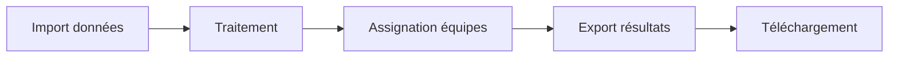

# 🚀 GuignoMap - Déploiement Streamlit Cloud

Guide complet pour déployer GuignoMap sur Streamlit Cloud avec gestion automatique des modes d'exécution.

## ⚡ Déploiement rapide

### 1. Connexion du dépôt

1. **Connectez-vous** à [Streamlit Cloud](https://share.streamlit.io/)
2. **Cliquez** sur "New app"
3. **Sélectionnez** votre repository GitHub `GuignoMap`
4. **Configurez** :
   - **Branch** : `main`
   - **Main file path** : `guignomap/app.py`
   - **Python version** : `3.13` (ou plus récent)

### 2. Configuration des secrets

1. **Accédez** aux paramètres de votre app
2. **Cliquez** sur "Secrets" dans le menu latéral
3. **Copiez** le contenu de `.streamlit/SECRETS_SAMPLE.toml`
4. **Collez** dans la zone "App secrets"
5. **Adaptez** les valeurs si nécessaire :

```toml
# Configuration recommandée pour Streamlit Cloud
MODE = "demo"
ALLOW_BCRYPT_FALLBACK = true
```

### 3. Déploiement

1. **Cliquez** sur "Deploy!" 
2. **Attendez** la compilation (~2-3 minutes)
3. **Vérifiez** que l'app démarre correctement
4. **Confirmez** l'affichage du mode "Démo (Cloud)" dans la sidebar

## 🔧 Configuration avancée

### Variables d'environnement optionnelles

Ajoutez dans les secrets selon vos besoins :

```toml
# Performance et logging
PYTHONUTF8 = "1"
STREAMLIT_LOGGER_LEVEL = "WARNING"

# Désactivation des analytics (optionnel)
STREAMLIT_BROWSER_GATHER_USAGE_STATS = false
```

### Commande personnalisée (alternative)

Si nécessaire, utilisez une commande personnalisée :

```bash
streamlit run guignomap/app.py --server.port $PORT --server.address 0.0.0.0
```

## 💾 Gestion de la persistance

### ⚠️ Limitations Streamlit Cloud

- **Stockage éphémère** : Les fichiers uploadés ne persistent pas entre les redémarrages
- **Base de données** : Recréée à chaque déploiement en mode demo
- **Exports** : Perdus si l'app redémarre

### 🎯 Solutions recommandées

1. **Mode démo** : Parfait pour démonstrations et tests
2. **Boutons de téléchargement** : Utilisez les exports CSV/Excel disponibles dans l'app
3. **Sauvegarde manuelle** : Téléchargez régulièrement vos données importantes

### 📊 Workflow de démonstration



## 🎭 Modes d'exécution

### Mode "demo" (recommandé Cloud)

- ✅ **Fallback intelligent** : DB principale → sample → création automatique
- ✅ **Pas d'erreur** si aucune DB présente
- ✅ **Données échantillon** créées automatiquement
- ✅ **Idéal** pour démonstrations et tests

### Mode "client" (production locale)

- 🔒 **Exige DB principale** : `guigno_map.db` doit exister
- 🔒 **Erreur explicite** si DB manquante
- 🔒 **Mode strict** pour environnements de production
- 🔒 **Recommandé** pour installations locales avec données réelles

## 🛠️ Dépannage

### App ne démarre pas

1. **Vérifiez** les logs de déploiement
2. **Confirmez** Python 3.13+ 
3. **Vérifiez** le chemin du fichier principal
4. **Consultez** la section Requirements

### Erreurs de configuration

```toml
# Secrets minimaux requis
MODE = "demo"
```

### Performance lente

```toml
# Optimisations recommandées
STREAMLIT_LOGGER_LEVEL = "WARNING"
PYTHONUTF8 = "1"
```

## 📋 Checklist de déploiement

- [ ] Repository connecté sur Streamlit Cloud
- [ ] Fichier principal : `guignomap/app.py`
- [ ] Python version : 3.13+
- [ ] Secrets configurés avec `MODE = "demo"`
- [ ] App déployée et accessible
- [ ] Mode affiché correctement dans la sidebar
- [ ] Import/export fonctionnels
- [ ] Boutons de téléchargement testés

## 🔗 Ressources utiles

- [Documentation Streamlit Cloud](https://docs.streamlit.io/streamlit-community-cloud)
- [Gestion des secrets](https://docs.streamlit.io/streamlit-community-cloud/deploy-your-app/secrets-management)
- [Dépannage déploiement](https://docs.streamlit.io/streamlit-community-cloud/troubleshooting)

---

*GuignoMap v4.2+ - Système de gestion flexible avec modes d'exécution adaptatifs*